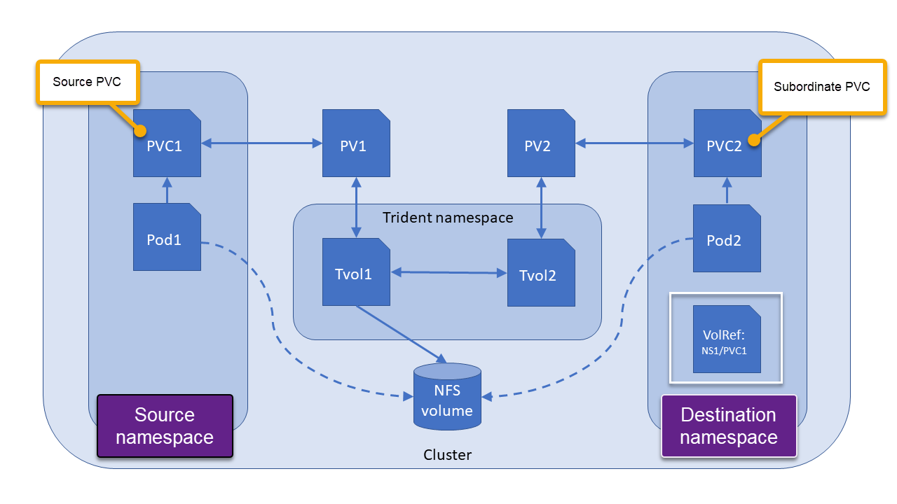

#########################################################################################
# SCENARIO 22: Sharing NFS volume across namespaces
#########################################################################################

Have you ever wanted to share volumes between Kubernetes namespaces? You can now! Trident `v22.10` introduced cross-namespace volume access!  

This Kubernetes-native solution has the following benefits:
- Multiple levels of access control to ensure security
- Works with all Trident NFS volume drivers
- No reliance on tridentctl or any other non-native Kubernetes feature


This diagram illustrates NFS volume sharing across two Kubernetes namespaces:
<p align="center"></p>

## A. Set up the environment

### First things first, ensure you are using version `22.10` of Trident

```sh
$ kubectl get tver -n trident
NAME      VERSION
trident   22.10.0
```
If you aren't, follow the steps in [Scenario01](../Scenario01) in order to upgrade to version `22.10`  

### Ensure you have configured nas backend `nas-default` and storage-class `storage-class-nas` from [Scenario02](../Scenario02)  
```
$ kubectl get tbc -n trident
NAME                                BACKEND NAME      BACKEND UUID                           PHASE   STATUS
backend-tbc-ontap-nas-default       nas-default       1f5a1e30-5628-428f-9f63-4a68283b6c99   Bound   Success
s

$ kubectl get sc
NAME                          PROVISIONER             RECLAIMPOLICY   VOLUMEBINDINGMODE   ALLOWVOLUMEEXPANSION   AGE
storage-class-nas (default)   csi.trident.netapp.io   Delete          Immediate           true                   49m
```


## B. Create primary namespace, PVC and Pod
```sh
$ kubectl create ns primary
$ kubectl create -f primary-pvc.yaml
$ kubectl create -f primary-pod.yaml
```
This will create the primary PVC and mount it into a busybox pod, in the `primary` namespace.

Notice the annotation `shareToNamespace` in `primary-pvc.yaml`, granting access to the volume from the `secondary` namespace
```yaml
  annotations:
    trident.netapp.io/shareToNamespace: secondary
```

 Confirm creations of resources with:

```
$ kubectl get pod,pvc -n primary
NAME                READY   STATUS    RESTARTS   AGE
pod/busybox-primary   1/1     Running   0          41m

NAME                                STATUS   VOLUME                                     CAPACITY   ACCESS MODES   STORAGECLASS        AGE
persistentvolumeclaim/primary-pvc   Bound    pvc-c7b2e6f5-0c7f-41db-938b-646721805d63   100Gi      RWX            storage-class-nas   47m
```

Access the primary busybox pod shell and create a test file in the persistent volume:

```
$ kubectl exec -it busybox-primary -n primary  -- sh

/ # echo "Testing cross-namespace volumes" > /mnt/sharedvolume/testfile.txt
```
Exit pod shell with `CTRL-D`

## C. Create a TVR CR and subordinate PVC

Create a TridentVolumeReference CR in the destination namespace that refers to the source namespace PVC.
```
$ kubectl create ns secondary
$ kubectl create -f tvr.yaml
```

Create the secondary PVC

```
$ kubectl create -f secondary-pvc.yaml
```

Notice the annotation `shareFromPVC` in `secondary-pvc.yaml`, referencing the source namespace and PVC:
```yaml
  annotations:
    trident.netapp.io/shareFromPVC: primary/primary-pvc
```
Check creation of resources with:
```
$ kubectl get tvr,pvc -n secondary
NAME                                                 AGE
tridentvolumereference.trident.netapp.io/busybox-pvc   51m

NAME                                  STATUS   VOLUME                                     CAPACITY   ACCESS MODES   STORAGECLASS        AGE
persistentvolumeclaim/secondary-pvc   Bound    pvc-8b0e35ae-85e1-4d92-9c75-e62187919f1f   100Gi      RWX            storage-class-nas   49m
```

Also notice with tridentctl that only one volume was created, but two PVCs: one of which is shown as `subordinate`
```
$ tridentctl get backend -n trident
+-----------------+-------------------+--------------------------------------+--------+---------+
|      NAME       |  STORAGE DRIVER   |                 UUID                 | STATE  | VOLUMES |
+-----------------+-------------------+--------------------------------------+--------+---------+
| nas-default     | ontap-nas         | 1f5a1e30-5628-428f-9f63-4a68283b6c99 | online |       1 |
+-----------------+-------------------+--------------------------------------+--------+---------+

$ tridentctl get volumes -n trident
+------------------------------------------+---------+-------------------+----------+--------------------------------------+-------------+---------+
|                   NAME                   |  SIZE   |   STORAGE CLASS   | PROTOCOL |             BACKEND UUID             |    STATE    | MANAGED |
+------------------------------------------+---------+-------------------+----------+--------------------------------------+-------------+---------+
| pvc-8b0e35ae-85e1-4d92-9c75-e62187919f1f | 10 GiB | storage-class-nas | file     | 1f5a1e30-5628-428f-9f63-4a68283b6c99 | subordinate | true    |
| pvc-c7b2e6f5-0c7f-41db-938b-646721805d63 | 10 GiB | storage-class-nas | file     | 1f5a1e30-5628-428f-9f63-4a68283b6c99 | online      | true    |
+------------------------------------------+---------+-------------------+----------+--------------------------------------+-------------+---------+
```

## D. Create Pod in the secondary namespace and mount the subordinate volume

```
$ kubectl create -f secondary-pod.yaml
pod/busybox-secondary created

$ kubectl get pods -n secondary
NAME              READY   STATUS    RESTARTS   AGE
busybox-secondary   1/1     Running   0          58m
```

Access the Pod shell and check the test file in the shared volume:
```
$ kubectl exec -it busybox-secondary -n secondary  -- sh

/ # cat /mnt/sharedvolume/testfile.txt
Testing cross-namespace volumes
```
Exit pod shell with `CTRL-D`


**Voilà! we have demonstrated the use of cross-namespace Persistent Volumes with Trident!**

## E. Cleanup

Delete Pods:
```
$ kubectl delete -f primary-pod.yaml -f secondary-pod.yaml
```
Delete PVCs and TVR:
```
$ kubectl delete -f primary-pvc.yaml -f secondary-pvc.yaml
$ kubectl delete -f tvr.yaml
```
Delete Namespaces:
```
$ kubectl delete ns primary secondary
```
